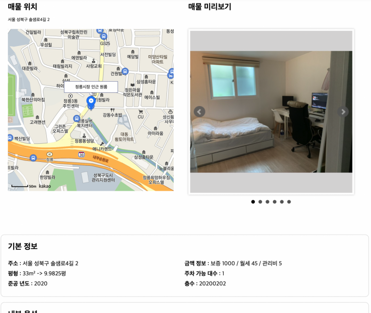

# 그누보드5 부동산 중개 게시판 스킨

개인 외주로 만든 부동산 매물 게시판 스킨입니다.

기존에 공개되어있던 스킨은 오래되어 유지보수 및 오류로 사용할 수 없는 상태여서 새롭게 제작했습니다.

카카오맵과 다음 도로명주소 기반으로 동작합니다.

# 설치 방법

## 카카오맵 API 발급

1.  *[카카오 개발자사이트](https://developers.kakao.com/)* (https://developers.kakao.com) 접속
2.  개발자 등록 및 앱 생성
3.  웹 플랫폼 추가: 앱 선택 – [플랫폼] – [Web 플랫폼 등록] – 사이트 도메인 등록
4.  사이트 도메인 등록: [웹] 플랫폼을 선택하고, [사이트 도메인] 을 등록합니다. (예: http://localhost:8080)
5.  페이지 상단의 [JavaScript 키] 복사합니다.

## view.skin.php 13번 라인, write.skin.php 8번라인에 카카오 개발자에서 발급 받은 API 삽입

## skin/board/ 에 업로드

## 분류 사용 설정

## 게시판 여분 필드 설정.

kind로 설정해야합니다. 필드들은 |으로 구분하며 첫번째 값은 '건물 종류'로 작성합니다.

# 사용 주의사항

본문에 삽입되는 사진을 기반으로 슬라이더를 만듭니다.

별도의 첨부파일로 이미지를 첨부하실 경우 슬라이더에 이미지가 뜨지 않습니다.

첨부파일 개수를 0개로 조정하는 것도 방법이겠네요.

# 참고

그누보드관련 개발은 처음이라 부족한 점이 많습니다. 피드백 주실 분들은 깃허브를 통해 남겨주세요.

즐거운 하루 되세요.